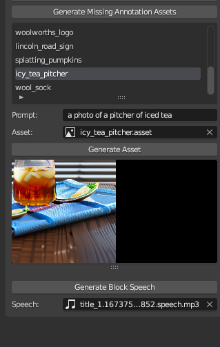

# weaver-blender

This is the [Blender](https://blender.org)-based backend for the Plot Device service, which creates animated vertical videos for any piece of web content, using LLMs to orchestrate the animations and narration.

## Screenshots

